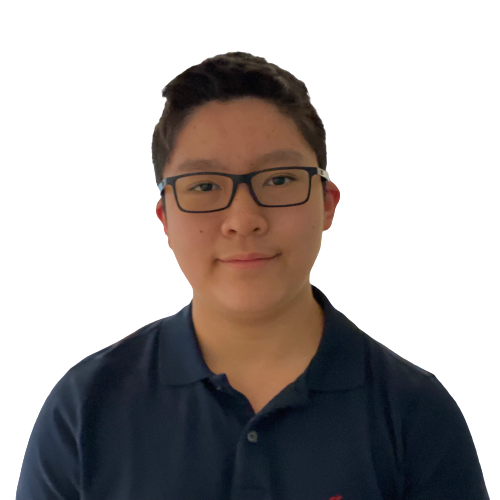

 
 
 
)
)

 

Welcome to my GitHub! I'm Eason Wu, a curious student in Ottawa, Canada. I am interested in topics within AI (NLPs, Machine Learning, and Deep Learning) and sustainability, particularly Cellular Agriculture. I am also an innovator at The Knowledge Society (TKS). I love learning, and right now I am focusing on Deep Learning. Here on my GitHub you can find most of my AI projects! 

 

